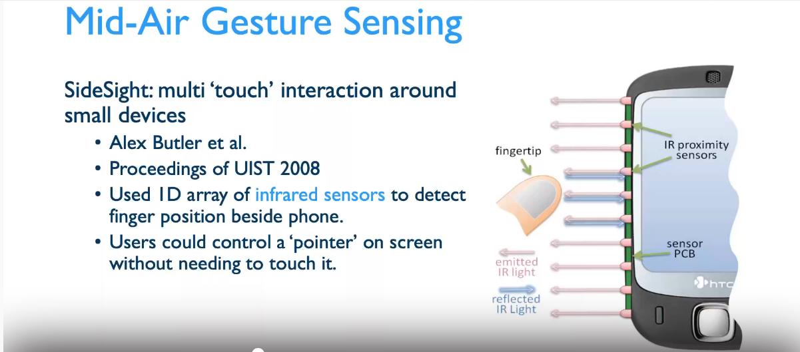

## 1 Guitar Tuner（吉他调音器）：
use standard microphone get the real-time voice singnal of guitar，
help guitar users to calibrate(校准) the tones of each string

according to Equal temperament(12 Equal temperament(12-TET))(12平均律), we use 440Hz as our reference pitch(参考音高), we got open tunings of each string.

calculation Method:

open string 1 E4 440.0000 / 2 ^ ( 5 / 12 ) = 329.6276 Hz

open string 2 B3 440.0000 / 2 ^ ( 10 / 12 ) = 246.9417 Hz

open string 3 G3 440.0000 / 2 ^ ( 14 / 12 ) = 195.9977 Hz

open string 4 D3 440.0000 / 2 ^ ( 19 / 12 ) = 146.8324 Hz

open string 5 A2 440.0000 / 2 ^ ( 24 / 12 ) = 110.0000 Hz

open string 6 E2 440.0000 / 2 ^ ( 29 / 12 ) = 82.4069 Hz

Cheapest one
we only need to buy a microphone, I already have a guitar here,Lol

## 2 gesture detection by using IR proximity sensors (近红外传感器)

we can use a IR proximity marix sensors to detect the direction of moving thing. and set several sets of paramaters to define what kind of gesture it is

Unknown but I think it will be more fun than first one,or higher score

## 3 
